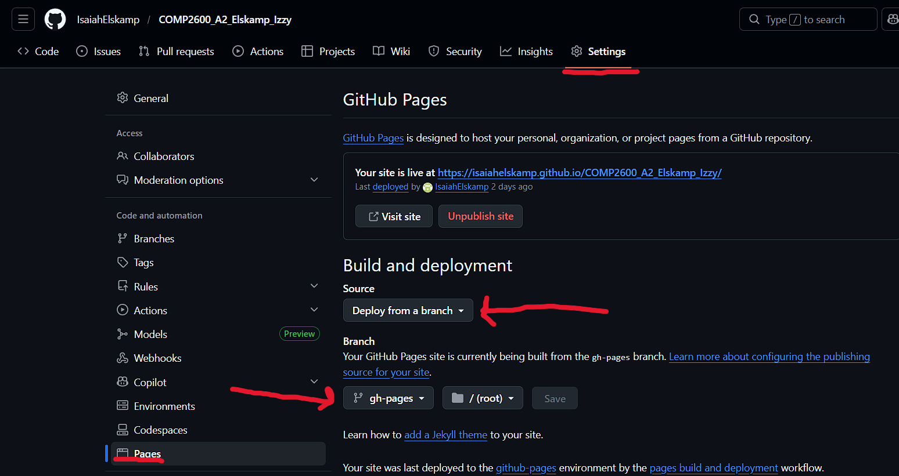
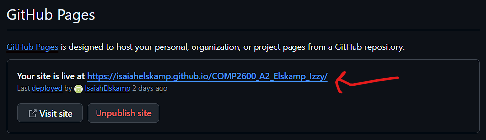

# Hosting a Resume on GitHub Pages with the Pelican Static Site Generator (Windows)

## Statement of Purpose

This README describes how to host a markdown-formatted resume using Github pages and the Pelican static site generator. This guide is written for readers like Marvin McLaren who have basic markdown and command line knowledge, but do not have any prior experience with forges or static site generators. 

This document gives detailed instructions for each step of the process, and links these steps to the principles of technical writing described in "Modern Technical Writing" by Andrew Etter. The document also contains further readings on the topic, and a FAQ to answer your burning questions.

>[!NOTE]
> This tutorial is for Windows machines only.

Every time you see a code block like this:
```
Code block
```
It means you have to enter the command within the block into Windows PowerShell.

## Table of Contents

- [Prerequisites](#prerequisites)
- [Instructions](#instructions)
  - [Project Setup](#project-setup)
    - [Python Installation](#python-installation)
    - [Pelican Installation](#pelican-installation)
  - [Editing the Site](#editing-the-site)
    - [Add your Resume to the Site](#add-your-resume-to-the-site)
  - [Hosting the Site](#hosting-the-site)
    - [GitHub Repository and Git Setup](#github-repository-and-git-setup)
    - [GitHub Pages Setup](#github-pages-setup)
- [Further Resources](#further-resources)
- [FAQ](#faq)
- [Credits](#credits)

## Prerequisites

- A Windows machine running Windows 10 or 11
- A [GitHub](github.com) account

## Instructions

### Project Setup

#### Python Installation

>[!Note]
> If you already have Python installed (version must be at least 3.10), skip to [Pelican Installation](#pelican-installation).

1. Go to [Python Downloads](https://www.python.org/downloads/) and click the yellow button that states "Download Python (version number)".
2. Open the exe and follow the Python setup wizard.

#### Pelican Installation

1. Open Windows PowerShell and enter this command:
```
python -m pip install "pelican[markdown]"
```
### Create and Host your Resume Website

#### Generate a New Site and Run it Locally

1. Create a new directory for your project:
```
mkdir projectName
```
2. Navigate to the directory:
```
cd projectName
```
3. Start a new Pelican generation process:
```
pelican-quickstart
```
4. Answer the questions like this (where there is no answer is where you press "Enter" on your keyboard):
```
> Where do you want to create your new web site? [.]
> What will be the title of this web site? MarvinsResume
> Who will be the author of this web site? Marvin
> What will be the default language of this web site? [English]
> Do you want to specify a URL prefix? e.g., https://example.com   (Y/n) n
> Do you want to enable article pagination? (Y/n) n
> What is your time zone? [Europe/Rome]
> Do you want to generate a tasks.py/Makefile to automate generation and publishing? (Y/n) n
```  
5. Generate your website:
```
pelican content
```
6. Run your website locally:
```
pelican --listen
```
### Editing the site

#### Add your Resume to the Site

Etter describes lightweight markup languages (like Markdown) as "free and superior in every meaningful way". Markdown is used to create documentation (and in this case the resume) as it offers an extremely simple and widely known standard for technical writing.

Now that you have generated and run your website, you can add a Markdown formatted page to the site which contains your resume.

1. Navigate to the contents folder:
```
cd projectName\contents
```
2. Create a folder to hold your pages. It must be named "pages":
```
mkdir pages
```
3. Navigate into the pages folder:
```
cd pages
```
4. Create your resume.md Markdown file:
```
Notepad resume.md
```
This will open notepad and prompt you to create a new file called "resume". Click yes and you can begin editing.

5. Edit your resume.md file in notepad and save it using **Ctrl + S** once you have completed the resume.

### Hosting the Site

#### GitHub Repository and Git Setup

Etter recommends DVCS (Distributed Version Control Systems) like GitHub over centralized systems as they have better performance, allow for offline work, and are superior for concurrent work on the same file. Developers prefer them, so it is in the best interest that technical writers do as well.

In order to host your website on GitHub pages, you first need to create a repository. This section also covers how to pull and push changes to and from your newly created GitHub repository.

1. Log in to your GitHub account on a browser and click the ``+`` button in the top right corner.
2. Click ``New Repository``.
3. Enter a name, and leave all other settings as default.
4. Click ``Create Repository``.
5. Copy the url of your repository from your browser once you are inside. For example, mine would look like: https://github.com/IsaiahElskamp/COMP2600_A2_Elskamp_Izzy.git. We will use this later.

6 Open Windows Powershell again and make sure you are back inside your project directory. Enter these commands below to initialize Git:
```
git init
git remote add origin https://github.com/IsaiahElskamp/COMP2600_A2_Elskamp_Izzy.git
```
7. Pull anything that is in your repository. This ensures your local project contains everything in your repository (which should be nothing at this point, but this is good practice anyways).
```
git pull origin main
```
8. Push your local files to the main branch in GitHub:
```
git add .
git commit -m "merge"
git push
```
Now your github repository will contain all the files your project needs to run.

#### GitHub Pages Setup

Etter recommends hosting static sites on platforms like GitHub as they require no server-side application dependencies, no databases, and nothing to install. He explains that moving a static site is as easy as moving a directory.

This section covers how to make a separate branch for your site output, and how to then use that branch to host your site on GitHub Pages.

1. Install GitHub Pages import:
```
python -m pip install ghp-import
```
2. Generate your site:
```
python -m pelican content
```
3. Commit and push the output to a separate branch called ghp-pages:
```
python -m ghp_import output -b gh-pages
git push origin gh-pages
```
4. Navigate to your GitHub repository in your browser again and click **Settings > Pages** (see figure 1).
5. Select **Deploy from a Branch** under the **Source** header (see figure 1).
6. Select **gh-pages** under the **Branch** header (see figure 1).

Figure 1:


7. Click **Save** and your site will now be hosted on the link that is provided to you (see figure 2).

Figure 2:


Your site is now completed!

## Further Resources

- [Markdown Basic Guide](https://quarto.org/docs/authoring/markdown-basics.html) - Basic formatting guide for the Markdown language
- [Pelican Quickstart Documentation](https://docs.getpelican.com/en/stable/quickstart.html) - Official Pelican documentation on how to install the software and generate a new website
- [Python for Windows](https://docs.python.org/3/using/windows.html) - A general overview for using/installing Python on Microsoft Windows
- [Creating a GitHub Pages Site](https://docs.github.com/en/pages/getting-started-with-github-pages/creating-a-github-pages-site) - A set of steps for setting up a new site from your repository using GitHub Pages

## FAQ

**Q: Why do I have to use the GitHub Forge to host my site?**

A: You don't! Since Pelican gives such a simple output, you can use any Forge with built-in static site hosting. Some other popular Forges with this feature include [Codeberg](https://codeberg.org/) and [Gitlab](https://about.gitlab.com/).


**Q: How do I update my site if it is already hosted?**

A: To update your site again, you will have to first re-generate your Pelican site and route the output to your gh-pages branch after you have made your changes. Enter this into your command line while within the project directory:
```
python -m pelican content
python -m ghp_import output -b gh-pages
```
Now you can push to the gh-pages branch... 
```
git push origin gh-pages
```
and your hosted site will be updated!

## Credits

Modern Technical Writing - Andrew Etter

Proofreaders:
- Conner Lavineway
- Christian Javen Samson


